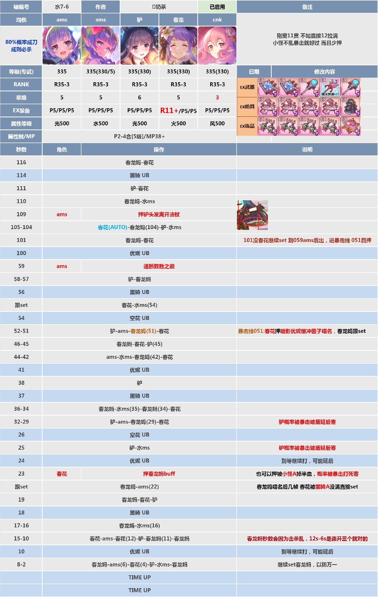

# 水7-6 顺序轴说明

这份说明对应当前目录中的两个文件：

- `顺序轴示例原图.jpg`：人工编写的水7-6规划表。
- `顺序轴示例.txt`：已经转换为可导入助手的顺序轴文件。

原图中的“秒数、角色、操作、说明”是给人看的规划表；`.txt`文件中的字段才是程序实际解析和执行的内容。



## 一、先看角色对应关系

战斗界面的角色位置固定为从左到右的角色1～角色5。示例文件用表头别名把它们对应到原图中的角色名：

| 程序角色 | 轴文件别名 | 原图角色 |
|---|---|---|
| 角色1 | `ams` | ams |
| 角色2 | `水ms` | 水ms |
| 角色3 | `驴` | 驴 |
| 角色4 | `春龙` | 春龙 |
| 角色5 | `cnk` | cnk |

因此，下面两行在顺序轴中等价：

```text
1:16 | 点击=角色4
1:16 | 点击=春龙
```

角色别名只适用于顺序轴的 `点击=`。`UB后=`、`卡帧=`必须写标准名称，例如 `角色5`，不能写 `cnk`。

原图中的作者、装备、星级、等级、备注和“TIME UP”不是当前轴文件字段，不会被程序自动解析。需要让助手执行的内容，必须转换成时间节点和动作字段。

## 二、完整可导入文件

下面是示例文件的规范化写法。原文件中 `1:05` 行的分隔符没有全部加空格、`1:11` 的角色4行末有空格，这些不会影响解析，但建议按下面的格式保存。

```text
轴类型=顺序
轴名称=水7-6
点击间隔=100

角色1=ams
角色2=水ms
角色3=驴
角色4=春龙
角色5=cnk

[轴]
1:16 | 点击=角色4 | 点击=角色5
1:11 | 点击=角色3 | 点击=角色5
1:11 | 点击=角色4
1:10 | 点击=角色2
1:09 | 卡帧=角色1
1:06 | AUTO=开
1:05 | UB后=角色5 | 点击=AUTO | 点击=角色4 | 点击=角色3 | 点击=角色2
1:01 | 点击=角色4 | 点击=角色5
0:59 | 卡帧=角色1
0:58 | 点击=角色3
0:57 | 点击=角色4
0:56 | UB后=BOSS | 点击=角色5 | 点击=角色2
0:52 | 点击=角色3 | 点击=角色1
0:51 | 点击=角色4 | 点击=角色5
0:46 | 点击=角色4 | 点击=角色5
0:45 | 点击=角色3
0:44 | 点击=角色1 | 点击=角色2
0:42 | 点击=角色4 | 点击=角色5
0:38 | 点击=角色3
0:36 | 点击=角色4
0:35 | 点击=角色2
0:34 | 点击=角色4 | 点击=角色5
0:32 | 点击=角色3 | 点击=角色1
0:29 | 点击=角色4 | 点击=角色5
0:25 | 点击=角色3 | 点击=角色2
0:23 | 卡帧=角色5 | 点击=角色4
0:22 | 点击=角色1
0:19 | 点击=角色4 | 点击=角色5 | 点击=角色3
0:17 | 点击=角色4
0:16 | 点击=角色2
0:15 | 点击=角色5 | 点击=角色1
0:12 | 点击=角色5 | 点击=角色3
0:11 | 点击=角色4
0:10 | 点击=角色4
0:08 | 点击=角色4
0:06 | 点击=角色1
0:04 | 点击=角色5 | 点击=角色3
0:02 | 点击=角色2 | 点击=角色4
```

保存为 UTF-8 编码的 `.txt` 文件后，在 App 中导入并选中即可。顺序轴必须有 `轴类型=顺序` 和 `[轴]` 段。

## 三、文件头说明

```text
轴类型=顺序
轴名称=水7-6
点击间隔=100
```

### `轴类型=顺序`

告诉程序使用顺序轴运行方式。顺序轴可以在一行中安排多个动作，但所有动作按照文本出现顺序串行完成。

### `轴名称=水7-6`

这是轴列表中显示的名称，不影响执行。

### `点击间隔=100`

单位是毫秒，表示同一动作队列中普通点击之间的最小间隔。它不是角色等待 UB 的时间，也不是固定的技能延迟。当前支持范围是 `1～5000` 毫秒。

### 角色别名

```text
角色1=ams
角色2=水ms
角色3=驴
角色4=春龙
角色5=cnk
```

别名只减少 `点击=` 的书写长度，不改变角色编号。角色编号始终以战斗画面从左到右的位置为准。

## 四、最重要的执行规则

### 1. `点击=角色N`不是普通的一次点击

顺序轴中的角色点击是一次完整生命周期：

```text
确认角色N的 SET 为开
→ 等待角色N TP 从满值下降，确认角色N释放 UB
→ 关闭角色N的 SET
→ 才允许继续下一个动作
```

例如：

```text
1:16 | 点击=角色4 | 点击=角色5
```

实际执行顺序是：

```text
角色4 SET开 → 角色4 UB → 角色4 SET关
角色5 SET开 → 角色5 UB → 角色5 SET关
```

程序不会因为角色4动画较长就直接关闭角色4 SET，也不会在角色4 TP仍然满时提前进入角色5。TP下降事件和时钟识别相互独立；即使某一帧时钟识别失败，当前角色的 UB 仍可以推进 SET 关闭。

### 2. 同一秒仍然按文本顺序

示例中有三条 `1:11` 动作：

```text
1:11 | 点击=角色3 | 点击=角色5
1:11 | 点击=角色4
```

执行顺序是：

```text
角色3生命周期 → 角色5生命周期 → 角色4生命周期
```

不能把同一秒理解成“同时点击”。如果时钟从 `1:12` 跳到 `1:10`，程序也会按文件原始顺序补入已经跨过的节点。

### 3. 普通角色节点可以链式衔接

当前一个普通角色生命周期完成后，后面的普通角色节点可以在时钟尚未显示到目标秒数时继续执行。这用于处理同一秒内连续 UB 的情况。

这个提前链式规则只适用于普通角色点击。`AUTO`目标、`BOSS`触发和卡帧节点仍然要满足各自的触发条件。

## 五、示例轴的分段解释

### 1:16～1:10：开场连续角色动作

```text
1:16 | 点击=角色4 | 点击=角色5
1:11 | 点击=角色3 | 点击=角色5
1:11 | 点击=角色4
1:10 | 点击=角色2
```

这些都是普通角色生命周期。角色4、角色5、角色3、角色5、角色4、角色2会按书写顺序执行，每个角色都要经过“SET开、等待UB、SET关”。

这里没有写 `1:30` 开局目标，因此程序不会强制设置开局 AUTO 或五名角色 SET。若实际战斗需要固定开局状态，建议在 `[轴]` 后补一行，例如：

```text
1:30 | SET=关,关,关,关,关 | AUTO=开 | 提示=设置开局状态
```

### 1:09：第一次角色1卡帧

```text
1:09 | 卡帧=角色1
```

到达 `1:09` 后，悬浮窗进入卡帧状态。操作流程是：

1. 使用“释放帧”按钮逐帧观察游戏动作。
2. 到达目标帧后点击“确定”。
3. 程序在已经打开的暂停菜单中点击角色1头像，使角色1进入 SET。
4. 点击暂停菜单外区域返回战斗。
5. 自动等待角色1 UB，确认 TP 下降后关闭角色1 SET。
6. 卡帧生命周期完成后，继续执行后面的 `1:06` 节点。

暂停菜单中点击的是角色头像本身，不存在额外的“设置”按钮。卡帧确认流程没有必要再写 `点击=角色1`；重复写会被视为同一目标并去重。

### 1:06：把 AUTO 调整为开

```text
1:06 | AUTO=开
```

`AUTO=开`是状态目标，不是无条件点击。程序读取实机 AUTO 状态：

- 已经开启：不点击。
- 当前关闭：点击 AUTO 并等待画面确认。
- 状态不可信：暂缓点击，不猜测。

它会保持 AUTO 开启，直到后面出现新的 AUTO 目标或 `点击=AUTO`。

### 1:05：角色5 UB 后执行一串动作

```text
1:05 | UB后=角色5 | 点击=AUTO | 点击=角色4 | 点击=角色3 | 点击=角色2
```

这行不是到 `1:05` 就立即执行。程序先在 `1:05` 节点武装角色5 UB监听，只有识别到角色5下一次 TP 下降后，才开始执行后续动作：

```text
角色5 UB被识别
→ 点击一次 AUTO
→ 角色4 SET开、等待UB、SET关
→ 角色3 SET开、等待UB、SET关
→ 角色2 SET开、等待UB、SET关
```

`点击=AUTO`表示单次切换当前 AUTO 状态。由于前面有 `AUTO=开`，这通常用于在角色5 UB后关闭 AUTO；如果业务要求“无论当前状态如何都必须关闭”，应使用状态目标 `AUTO=关`，不要依赖一次反向点击。

### 1:01～0:57：卡帧后的连续动作

```text
1:01 | 点击=角色4 | 点击=角色5
0:59 | 卡帧=角色1
0:58 | 点击=角色3
0:57 | 点击=角色4
```

`0:59` 卡帧与 `1:09` 的处理方式相同。确认卡帧后先完成角色1的 SET→UB→SET关生命周期，然后再按时间轴继续角色3和角色4。

### 0:56：等待 Boss UB 后立即执行

```text
0:56 | UB后=BOSS | 点击=角色5 | 点击=角色2
```

到 `0:56` 时只进入 Boss UB 等待，不会因为时钟到点而直接点击角色5。程序通过倒计时异常停表和角色 TP 变化识别 Boss UB：

```text
识别到 Boss UB
→ 角色5 SET开、等待UB、SET关
→ 角色2 SET开、等待UB、SET关
```

本行没有写 `延迟`，因此 Boss UB 被确认后立即进入后续动作。若需要在 Boss UB 后额外等待，可以写：

```text
0:56 | UB后=BOSS | 延迟=1.20 | 点击=角色5
```

带正延迟时，延迟从 Boss UB 完整确认时刻开始计算。Boss 提前确认时长可在设置中调整，单位是毫秒，默认 `7000ms`。

### 0:23：角色5卡帧后接角色4

```text
0:23 | 卡帧=角色5 | 点击=角色4
```

这里包含两个不同阶段：

```text
确认卡帧并在暂停菜单点击角色5
→ 返回战斗
→ 等待角色5 UB并关闭角色5 SET
→ 角色4 SET开、等待UB、关闭角色4 SET
```

不需要额外写 `点击=角色5`，因为 `卡帧=角色5`已经包含角色5的一次性生命周期。

### 0:22～0:02：收尾动作

后续行全部是普通定时角色生命周期，例如：

```text
0:19 | 点击=角色4 | 点击=角色5 | 点击=角色3
0:15 | 点击=角色5 | 点击=角色1
0:04 | 点击=角色5 | 点击=角色3
0:02 | 点击=角色2 | 点击=角色4
```

每行仍然从左到右串行执行。`0:10`、`0:08` 连续两次点击角色4，表示两个独立的角色4 UB生命周期，不是重复点击同一个 SET 状态。

## 六、字段速查

| 写法 | 类型 | 含义 |
|---|---|---|
| `点击=角色4` | 普通角色动作 | 角色4 SET开，等待角色4 UB，再关 SET |
| `点击=角色4,角色5` | 角色动作列表 | 先完整执行角色4，再完整执行角色5 |
| `点击=AUTO` | 单次控制动作 | 点击一次 AUTO，等待画面确认 |
| `AUTO=开` | 状态目标 | 将 AUTO 收敛到“开”，已开时不点击 |
| `AUTO=关` | 状态目标 | 将 AUTO 收敛到“关” |
| `SET=开,关,开,关,关` | 状态目标 | 将角色1～5的 SET 收敛到指定状态 |
| `UB后=角色5` | 角色触发 | 节点到时后等待角色5下一次 UB |
| `UB后=BOSS` | Boss触发 | 节点到时后等待实际 Boss UB |
| `延迟=1.20` | Boss额外延迟 | Boss UB确认后再等待1.20秒 |
| `卡帧=角色1` | 手动卡帧 | 确认时点击角色1头像，返回战斗后等待其UB并关SET |
| `提示=文字` | 说明动作 | 在悬浮窗显示文字，不改变战斗状态 |

## 七、SET 兜底和识别安全

正常情况下，角色 TP 下降就是关闭 SET 的同步信号，不会额外固定等待“兜底毫秒数”。

当 TP 事件因动画或识别抖动丢失时，程序才使用“设置 → 顺序轴 SET 兜底”中的毫秒值。该兜底具有以下限制：

- 只针对已经开始的当前角色生命周期。
- 角色 SET 在实机画面确认开启后才会武装。
- 目标角色 TP 仍满时不会关闭 SET。
- 低 TP 证据需要连续稳定采集帧，单帧误识别不会结束生命周期。
- 生命周期结束并确认 SET 关闭后，才会继续下一动作。

因此，兜底值不是给每个角色增加的固定延迟，也不应通过把它调得很大来代替正确的 UB 识别。遇到卡帧或动画较长时，优先检查角色头像、TP区域和当前 SET 状态。

## 八、编写和导入检查清单

导入前逐项检查：

1. 文件使用 UTF-8 编码，扩展名为 `.txt`。
2. 包含 `轴类型=顺序` 和唯一的 `[轴]` 段。
3. 时间使用 `M:SS`，范围为 `0:00～1:30`，例如 `1:05`，不要写 `1:5`。
4. 角色别名只用于 `点击=`；`UB后=`和`卡帧=`使用角色1～角色5。
5. `点击=角色N`按左到右排列，确认这就是希望的串行顺序。
6. `点击=AUTO`是反向点击；需要固定状态时使用 `AUTO=开/关`。
7. `SET=`必须写满五个值，并按角色1～角色5排列。
8. `UB后=角色N`和 `UB后=BOSS`只在触发事件发生后执行，不会单纯因时间到点执行。
9. `卡帧=角色N`已经包含暂停菜单点击角色头像和后续 SET 生命周期，不要重复添加同角色点击。
10. 导入后在轴列表中确认名称和类型，战斗开始后轴会锁定；要修改轴，先重置当前战斗。

## 九、建议的实机验证顺序

不要第一次就直接跑完整 1:16～0:02 轴。建议先复制一份短轴，只保留以下节点：

```text
轴类型=顺序
轴名称=水7-6验证
点击间隔=100
角色1=ams
角色2=水ms
角色3=驴
角色4=春龙
角色5=cnk

[轴]
1:16 | 点击=角色4 | 点击=角色5
1:09 | 卡帧=角色1
1:05 | UB后=角色5 | 点击=AUTO | 点击=角色4
0:56 | UB后=BOSS | 点击=角色5 | 点击=角色2
```

验证重点：

- 角色4完成 UB 后是否才开始角色5。
- 卡帧确定后是否点击暂停菜单中的角色头像，并在返回战斗后关闭对应 SET。
- 角色5 UB 后 `点击=AUTO` 是否按预期切换。
- `0:56` 是否等待真实 Boss UB，而不是到点立即点击。

确认短轴行为正确后，再导入完整水7-6轴。调试期间可以打开识别诊断，结合悬浮窗中的当前动作、下一动作、TP和控制状态检查每个节点。
